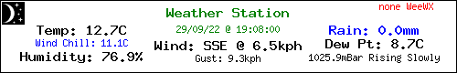

**12 Feb 2024**

Update notes for weewx 5.x versions

**13th Oct 2022**

Package up main as [Fixes: Numerous](https://github.com/glennmckechnie/weewx-WXgraphic/releases/tag/v0.6.7)
See release notes and v0.6.7 comments below

(Pending for v0.6.8:

The next release, and current main v0.6.8 will offer, via skin.conf; Colors to all images, fonts to the custom image.

A bash script - remove-gettext.sh - to modify the templates (instead of the single, out of date, config.txt.tmpl.no-lang file)

Use nodataimage() for invalid data (besides missing)

**9th Oct 2022**
v0.6.7

If you have weewx version 4.6.0 or greater then the languages feature (lang) will work for you.
If you have a version older than that you will need to use config.txt.tmpl.no_lang, after you rename then replace the existing config.txt.tmpl

If you haven't installed the optional [extended almanac](https://weewx.com/docs/customizing.htm#Almanac) for WeeWX, you won't get sunrise nor sunset data. That means the day/night icon cannot be calculated, no matter how you set the skin.conf variable curr_cond_icon.
The script now ignores that fatal error and displays an image without the added icons.

**8th Oct 2022**
v0.6.7

It seems I made a poor choice changing the delimiter in wxgraphic-weewx.txt to a space. That doesn't play well with the AM PM time formats.

Changed it to a semi-colon ';' **with** the option in WXgraphic/skin.conf to change it again - to one of your choosing.

Third times the charm?  !

**3rd Oct 2022**


Internationalization: language configuration using WeeWX lang files. See the skins/WXgraphic/lang directory for templates.

And thanks to Hartmut we have a German language file - de.conf

For our other languages, use the spare language file en.conf.x as a template and rename, rework its contents accordingly. If you do one for yourself, it would be appreciated if you sent a copy to upload here.

When using clientraw.txt files, there was a php based conversion process that could be configured to do the job. It has been commented out as we (WeeWX users) don't require it. WeeWX will pass units, groups and do the conversion using its own routines.

Released as [International: language, using WeeWX lang files](https://github.com/glennmckechnie/weewx-WXgraphic/releases/tag/v0.6.6)

When using clientraw.txt files, there was a php based unit conversion process that could be configured. It has been commented out as we (WeeWX users) don't require it. WeeWX will pass units, groups using its own routines.

On a minor note, I've added the original source files (wxgraphic-XXX_6.3.zip) to the repo.

See changelog for older notices

## What is wxgraphic?

In the words of the original author, anolecomputer.com...

"
This script generates a graphical weather image in GIF, PNG or JPG format created from a user supplied background image and data file. This script supports true type fonts and built-in GD fonts.

To utilize this script you should understand the following basic concepts:

  1.  What file paths are, absolute and relative.
  2.  How to make your weather station software parse and upload a template file.
  3.  How to include an image file on a web page.

Additionally, if you wish to modify the text locations, customize the data points displayed, etc., you should have at least a basic understanding of PHP scripting, and a basic understanding of x,y coordinates within images."

## And as of now?

It is still a php script and it can create one of the following images (of your choice) from the data generated by [WeeWX](https://weewx.com/) and that is uploaded with the rest of your WeeWX html, to your favorite webserver - as long as it runs php.


1. Knowing your paths is still relevant, but the installer will handle that.
2. The installer will also take care of generating a template file.
3. You still need to know how to include an image file on a web page!

The original notes in the [skins/WXgraphic/README.txt](https://github.com/glennmckechnie/weewx-WXgraphic/blob/main/skins/WXgraphic/README.txt) file are still useful for understanding the configuration of the script and its various options, along with its use (Using The Script...) but the weewx installer now takes precedence.
    
Since v0.6.4 it is now being managed by wee_extension so your weewx preferences are transferred to the config file, and can be changed in the same manner as for any weewx skin - via skin.conf or your weewx.conf settings. With v0.6.6, configuration is further reduced and weewx language settings are available, or configurable.

The layout, and color selection still require manual editing of the config.txt.tmpl file, and that's where the README.txt still proves itself useful, or the **Editing section** below.
    
If you wish to use clientraw.txt, see the [[Clientraw]] section within the skin.conf file.

Otherwise this simple weewx skin will create a template that generates a suitable file to feed wxgraphic/index.php and that will be installed on your WeeWX  server.
    
Currently, the full range of icons are not used by this template. That appears to be dependent on a true VDS or a clientraw.txt file. We do get a day, night graphic though!
It could possibly work with a weewx-forecast installation? But I don't have one configured to try it.

php is unforgiving with errors. Most times it's a blank screen if you fubar something. apache2/error.log can give you a hint. Being ultra careful with editing the php file is the safest option, and backups.
    
A display_errors line has been added to the start of index.php. Uncomment it to get some feedback if you go down the manual php configuration path.
    
```    
// ini_set('display_errors',1);
```

Within the index.php & config.txt scripts there is an option that offers a 'write_custom' - 'custom' configuration. Use that if you really want to go hard at the modifications, and still retain the original banners, avatars etc.

Any of the images can be replaced with an image of your choosing. The WeeWX installation uses the *.png type files by default.

Edits to config.txt.tmpl will propagate to the webserver on each report cycle when those edits will be used by index.php. Rinse, repeat. (After making backups)


## Install, then configure


   1. Fetch the archive
   
      ```wget -O weewx-WXgraphic-main.zip https://github.com/glennmckechnie/weewx-WXgraphic/archive/refs/heads/main.zip```

   2. Use the appropriate weewx command to install it
    
      For weewx 5.x...
      
      ```sudo weectl extension install weewx-WXgraphic-main.zip```
      
      or the older 4,x versions use...
      
      ```sudo wee_extension --install=weewx-WXgraphic-main.zip```

   3. Restart weewx

      ```sudo /etc/init.d/weewx stop```

      ```sudo /etc/init.d/weewx start```

      or
 
      ```sudo systemctl stop weewx```

      ```sudo systemctl start weewx```
     
This will install a skin named WXgraphic under the skins directory and will also enable it in weewx.conf

   4. Configure your webserver.
    
It requires that your webserver runs php, and has access to GD.
There is a file named PHP_verify.php within the new (www)wxgraphic server directory. Access that from your browser and it should present a html page that will hopefully announce your successful web server setup, if not install php for your webserver, or satisfy its other needs.

When the weewx report cycle runs it will copy the www/wxgraphic directory to your webserver once, and once only. It will be named wxgraphic and will be in your weewx root directory (weewx/wxgraphic) by default.

   5. Configure the scripts output
    
The main configuration options are done by editing skin.conf
    
You have your choice of banner, banner_big, avatar or if nothing is selected, a default image sized at 150x150. The default image type is*.png The other types are jpeg and gif

The data to feed wxgraphic will be transferred at each weewx report cycle to (www) wxgraphic/DATA/weewx-wxgraphic.txt via the skins/WXgraphic/DATA/weewx-graphic.txt.tmpl
    
If you wish to use clientraw.txt then configure the [[Clientraw]] section within the skin.conf file.

The original script wxgraphic.php has been renamed as index.php. However, this installation does not install every file from the wxgraphic_6.3 source. They are available in the master file , or the github repo if you want them.

6. Usage:-

```http://your_weewx_servers_name/weewx/wxgraphic/```

If my server is up and running then the following link should show a live example after you click on it of course. [http://203.213.243.61/weewx/wxgraphic/](http://203.213.243.61/weewx/wxgraphic/). No guarantees it will be up and running though - ISP availability and all that.

Or as embedded html.

``````


## The next step - editing the php and trialling changes.

Everything is working as it should, BUT... You've changed the fonts, don't like the layout, colors, whatever.

The fastest and the safest way to make changes to that existing *working* layout is to edit the php files directly.

Have I mentioned making backups yet? No !?
Always make backups before changing a working set up. Do it frequently; now would be a good opportunity to learn and use [git](https://git-scm.com) even. It's ideal for this situation. (git init, git add, git commit, git checkout - and gitweb, all on a local installation)

Right. Back to it.

Once your safety net is in place and you're ready to edit the fragile stuff, you will need to disable the template generation for the config.txt file. In skin.conf comment out (add a #) to the template = config.txt.tmpl line at the end of the [CheetahGenerator] section. As per the following snippet...


```
[CheetahGenerator]
    search_list_extensions = user.wxgraphic.WXgraphic
        [[WXgraphic_weewx]]
        [...]
        [[Config]]
             encoding = strict_ascii
             #template = config.txt.tmpl

```

Once that is done you can go to the config.txt file on your webserver - weewx/wxgraphic/config.txt - and edit that file to your hearts content. Disabling the template prevents the config.txt file from being overwritten.

Doing it this way allows for the rapid testing of any changes.
```
Make change to config.txt
Refresh the image from your browser.
Re-edit the file.
Rinse.
Repeat.
Finish.
```
Once you have the image displaying as you want then go back to the skins/WXgraphic/config.txt.tmpl file and duplicate the changes you made to config.txt  (now would be a good time to majke a duplicate of config.txt, before it gets overwritten). Once that is done then reinstate the template generation (remove the comma you put in) and make sure that the edits you made to config.txt, have been duplicate correctly in config.txt.tmpl and the regenerated config.txt works as intended. (compare the new with the copy you made before).

Once you have a working config.txt file that is being generated from config.txt.tmpl; whether you disable or enable the template is a matter of choice. With this skin nothing changes after you settle on a working version. However, later on may you want to edit one of the settings in skin.conf and you will need the config.txt.tmpl running then. Your choice, you decide.


Text locations, colors etc can all be configured. The key for (x,y) is in the following example lines, in each function
eg:-


```/******************************************************************************/
/* write_custom: This function writes your values onto a custom 500X80 banner.*/
/*  imagecenteredtext($x, $y, $text, $size, $ttfsize, $color, $angle);        */
/******************************************************************************/
function write_custom() {
```
See the commit - [adjust write_custom x, y to suit image with new fonts](https://github.com/glennmckechnie/weewx-WXgraphic/commit/d8049e759b6a3bbfa8593e9d05f8e5514c80787e) for an actual example of changing color and position settings in that above function.

## Font examples

The following fonts are include in the installation. Some layout co-ordinates (the worst!) have been changed to suit the eye.

 none (uses the GD inbuilt default)
 OpenSans-Bold.tff
 OpenSans-Regular.ttf
  OpenSans.woff

## Troubleshooting

A call from a browser to a link like [http://203.213.243.61/weewx/wxgraphic/](http://203.213.243.61/weewx/wxgraphic/) should show an image. If my server is up and running then that link should show a live example. No guarantees it will be up and running though - ISP availability and all that.

After installation there will be a directory created on your webserver named wxgraphic (.../weewx/wxgraphic). Directly under that will be 22 (currently) visible files and 4 directories.

A default installation (no changes to skin.conf) requires default.png, index.php, PHP_verify.php, config.txt, and DATA/wxgraphic_weewx.txt to be correct and available in your webservers weewx/wxgraphics directory. If you have a version (v0.6.5) with languages, then lang/ as well

The PHP_verify.php file is used to test your webservers php installation. When accessed by your browser it should give you an indication whether you have php and GD enabled. If it returns just garbage text (its contents are php code) then php is not installed and you need to install php and php-gd. For example, on Debian Bookworm...

To install php...
<pre>apt install php8.2</pre>
and then to install the required php-GD...
<pre>apt install php8.2-gd</pre>

The PHP_verify.php file can be removed from the skin (and www/html/weewx/wxgraphic) directories once it has been used. It serves an important task, but only once (remove it from the skins/WXgraphic directory as well.

When that is successful we need to check that the 2 files we generate from the templates - config.txt and DATA/wxgraphic_weewx.txt are correct.

wxgraphic_weewx.txt (generated from .../skins/WXgraphic/DATA/wxgraphic_weewx.txt.tmpl) should look something like the example [wxgraphic_weewx.txt](/skins/WXgraphic/examples/wxgraphic_weewx.txt). That example shows the format and fields that you are expecting. There are 16 columns, one of which is blank - '' or 19 columns for a later version. As the columns are now space separated, count the spaces to get the column result. One of them may show up as 2 spaces / columns (curr_cond_icon)

config.txt (generated from skins/WXgraphic.config.txt.tmpl) should appear similar to the contents of [config.txt](skins/WXgraphic/examples/config.txt). Check that the data_file_path line

eg:- ```$data_file_path =  '/your_webservers_path/weewx/wxgraphic/DATA/wxgraphic_weewx.txt'```

returns something that looks like the example above - from the command line (the later version has 4 unit columns at the end of it) eg:- 
``` sudo cat /your_webservers_path/wxgraphic/DATA/wxgraphic_weewx.txt```

??? More to come, as they arise

## Problems, Help ?

Any problems, fixes, suggestions; lang files - raise an [issue](https://github.com/glennmckechnie/weewx-WXgraphic/issues) on github

