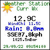

**26th Sept 2022**

This repo simplifies the installation of wxgraphic-6.3, a "Weather Graphic" image generator that was originally available at [anolecomputer.com/wxgraphic](https://web.archive.org/web/20130105094954/http://scripts.anolecomputer.com/wxgraphic/). That original file is also available at [Saratoga-Weather.org](https://saratoga-weather.org/wxtemplates/plugins.php)

It provides that original package as an easily installable skin for WeeWX. It uses the wee_extension script to install a working version to your existing WeeWX installation. Some configuration may be needed to suit your setup but it will work straight after installation and a restart. You may not be happy with the colors or fonts though and some text will need tweaking, just as it always has been.

You also need a php and GD (php-gd) enabled webserver!

## What is wxgraphic?

In the words of the original author, anolecomputer.com...

"
This script generates a graphical weather image in GIF, PNG or JPG format created from a user supplied background image and data file. This script supports true type fonts and built-in GD fonts.

To utilize this script you should understand the following basic concepts:

  1.  What file paths are, absolute and relative.
  2.  How to make your weather station software parse and upload a template file.
  3.  How to include an image file on a web page.

Additionally, if you wish to modify the text locations, customize the data points displayed, etc., you should have at least a basic understanding of PHP scripting, and a basic understanding of x,y coordinates within images."

## And as of now?

It is still a php script and it can create one of the following images (of your choice) from the data generated by [WeeWX](https://weewx.com/) and that is uploaded with the rest of your WeeWX html, to your favorite webserver - as long as it runs php.





1. Knowing your paths is still relevant, but the installer will handle that.
2. The installer will also take care of generating a template file.
3. You still need to know how to include an image file on a web page!

The original notes in the [skins/WXgraphic/README.txt](https://github.com/glennmckechnie/weewx-WXgraphic/blob/main/skins/WXgraphic/README.txt) file are still relevant to the configuration of the script and its various options, along with its use (Using The Script) etc.
The installation of the script should be straight forward as it uses wee_extension and picks up some default values (paths) from your WeeWX installation. Some choices have already been made (Metric labels) and others only you can supply (Image Title)

The script still works for the original file formats, eg:- clientraw.txt 
I don't have a working installation for that so some pointers for that files location will be helpful but you can use the data_file_path  = '' option in skin.conf to point to it.

Otherwise this simple weewx skin will create a template that generates a suitable file to feed wxgraphic/index.php and that will be installed on your WeeWX  server.
Currently, the icons are not available from this template. That appears to be dependent on VDS, clientraw.txt. We do get a day, night graphic though!
It could possibly work with a weewx-forecast installation?? But I don't have one, nor a clientraw.txt file to test it on (although it's available for WeeWX as part of a skin.)

php is unforgiving with errors. Most times it's a blank screen if you fubar something. apache2/error.log can give you a hint. Being ultra careful with editing the php file is the safest option, and backups.

Within the index.php & config.txt scripts there is a new option that offers a 'write_custom' - 'custom' configuration. Use that if you really want to go hard at the modifications, and still retain the original banners, avatars etc.

Any of the images can be replaced with an image of your choosing. The WeeWX installation uses the *.png type files by default.

Edits to config.txt.tmpl will propagate to the webserver on each report cycle when those edits will be used by index.php. Rinse, repeat. (After making backups)


## Install, then configure


   1. Fetch the archive
   
      ```wget -O weewx-WXgraphic-main.zip https://github.com/glennmckechnie/weewx-WXgraphic/archive/refs/heads/main.zip```

   2. Use wee_extension to install it
   
      ```sudo wee_extension --install=weewx-WXgraphic-main.zip```

   3. Restart weewx

      ```sudo /etc/init.d/weewx stop```

      ```sudo /etc/init.d/weewx start```

This will install a skin named WXgraphic under the skins directory and will also enable it in weewx.conf

   4. Configure your webserver.
    
It requires that your webserver runs php, and has access to GD.
There is a file named PHP_verify.php within the new (www)wxgraphic server directory. Access that from your browser and it should present a html page that will hopefully announce your successful web server setup, if not install php for your webserver, or satisfy its other needs.

When the weewx report cycle runs it will copy the www/wxgraphic directory to your webserver once, and once only. It will be named wxgraphic and will be in your weewx root directory (weewx/wxgraphic) by default.

   5. Configure the php script

Within that wxgraphic directory is a file named config.txt  That will require editing to change the configuration to suit your taste, set up.    
You have your choice of banner, banner_big, avatar or if nothing is selected, a default image. Only the *.png files are copied over. If you want the other formats (jpeg, gif) thats a manual job for you to perform.

The data to feed wxgraphic will be transferred at each weewx report cycle to (www) wxgraphic/DATA/weewx-wxgraphic.txt via the skins/WXgraphic/DATA/weewx-graphic.txt.tmpl
Some editing is required within the skin.conf file.

The original script wxgraphic.php has been renamed as index.php. However, this installation does not install every file from the wxgraphic_6.3 source. They are available in the master file , or the github repo if you want them.

6. Usage:-

```http://your_weewx_servers_name/weewx/wxgraphic/```

Or as embedded html.

``````


## The next step - editing the php and trialling changes.

Everything is working as it should, BUT... You've changed the fonts, don't like the layout, colors, whatever.

The fastest and the safest way to make changes to that existing *working* layout is to edit the php files directly.

Have I mentioned making backups yet? No !?
Always make backups before changing a working set up. Do it frequently; now would be a good opportunity to learn and use [git](https://git-scm.com) even. It's ideal for this situation. (git init, git add, git commit, git checkout - and gitweb, all on a local installation)

Right. Back to it.

Once your safety net is in place and you're ready to edit the fragile stuff, you will need to disable the template generation for the config.txt file. In skin.conf comment out (add a #) to the template = config.txt.tmpl line at the end of the [CheetahGenerator] section. As per the following snippet...


```
[CheetahGenerator]
    search_list_extensions = user.wxgraphic.WXgraphic
        [[WXgraphic_weewx]]
        [...]
        [[Config]]
             encoding = strict_ascii
             #template = config.txt.tmpl

```

Once that is done you can go to the config.txt file on your webserver - weewx/wxgraphic/config.txt - and edit that file to your hearts content. Disabling the template prevents the config.txt file from being overwritten.

Doing it this way allows for the rapid testing of any changes.

Make change to config.txt
Refresh the image from your browser.
Re-edit the file.
Rinse.
Repeat.
Finish.

Once you have the image displaying as you want then go back to the skins/WXgraphic/config.txt.tmpl file and duplicate those changes you made to config.txt Once that is done then reinstate the template generation and make sure that those changes you made still work as intended.

Once you have a working config.txt file that is being generated from config.txt.tmpl, whether you disable or enable the template is a matter of choice. With this skin nothing changes after you settle on a working version. However, later on may you want to edit one of the settings in skin.conf and you will need it running then. Your choice, you decide.


Text locations, colors etc can all be configured. The key for (x,y) is in the following example lines, in each function
eg:-


```/******************************************************************************/
/* write_custom: This function writes your values onto a custom 500X80 banner.*/
/*  imagecenteredtext($x, $y, $text, $size, $ttfsize, $color, $angle);        */
/******************************************************************************/
function write_custom() {
```
## Font examples

The following fonts are include in the installation. No layout co-ordinates have been changed although some could be! It is a showcase only.

 none (uses the GD inbuilt default)
 OpenSans-Bold.tff
 OpenSans-Regular.ttf
  OpenSans.woff


## Problems, Help ?

Any problems - raise an [issue](https://github.com/glennmckechnie/weewx-WXgraphic/issues) on github

